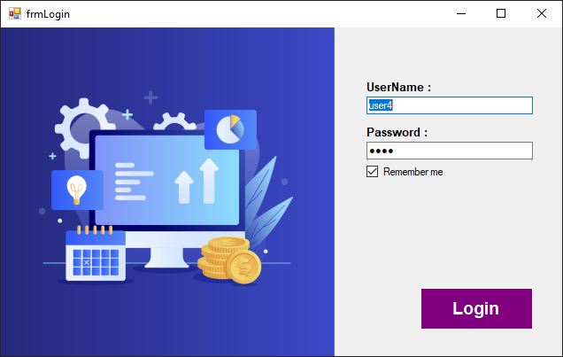
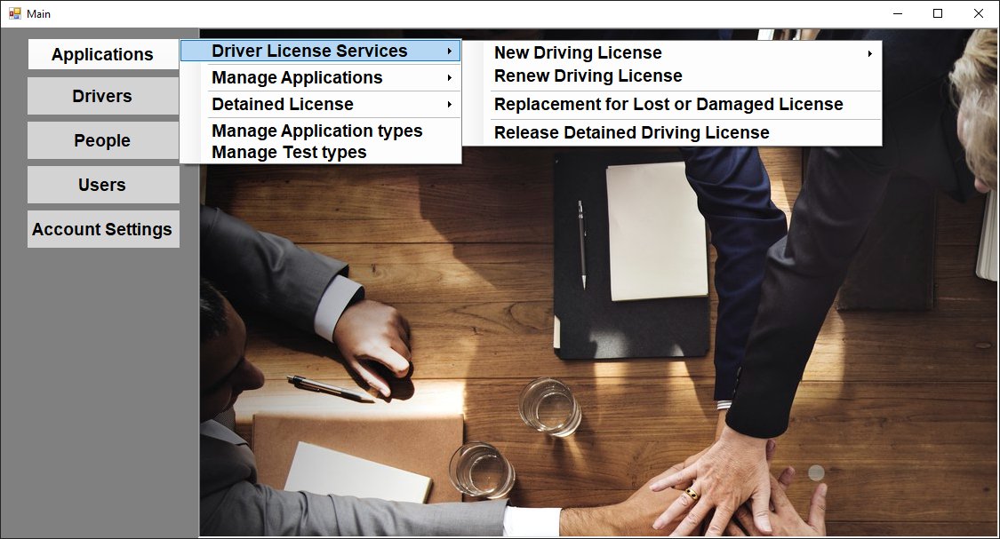
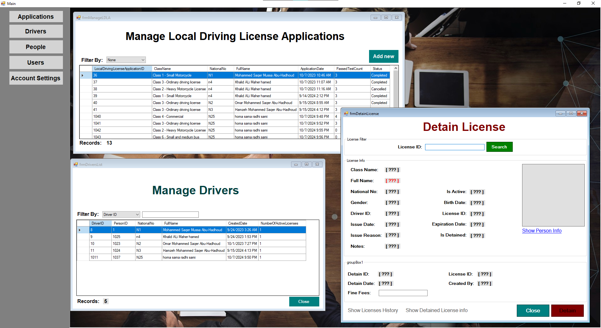

# DVLD - Driver and Vehicle Licensing Department Management System

[](https://dotnet.microsoft.com/download/dotnet-framework)
[](https://www.microsoft.com/en-us/sql-server)
[](https://docs.microsoft.com/en-us/dotnet/desktop/winforms/)
[](LICENSE)

> A comprehensive Driver and Vehicle Licensing Department management system built with C# Windows Forms and SQL Server. Manages license applications, driver records, testing procedures, and administrative operations using 3-tier architecture.

## 📸 Screenshots


*Login page*


*Main application dashboard*


*License management interfaces*

## ✨ Features

- 👥 **People Management** - Complete person registration and information management
- 🚗 **Driver Management** - Driver profiles, history, and status tracking
- 📋 **Application Processing** - Handle various license application types
- 🧪 **Testing System** - Vision, written, and practical test management
- 📜 **License Management** - Issue, renew, replace, and manage licenses
- 🔒 **License Control** - Detain and release license functionality
- 🌍 **International Licenses** - International driving permit management
- 👤 **User Management** - Role-based access control and authentication

## 🏗️ Architecture

**3-Tier Architecture:**
- **Presentation Layer** - Windows Forms UI
- **Business Logic Layer** - Business rules and validation
- **Data Access Layer** - Database operations with ADO.NET

## 🛠️ Technology Stack

- **Framework:** .NET Framework 4.7.2+
- **Language:** C#
- **Database:** SQL Server 2016+
- **Data Access:** ADO.NET
- **UI:** Windows Forms
- **Architecture:** 3-Tier Pattern

## 🚀 Quick Start

### Prerequisites

- Visual Studio 2019 or later
- .NET Framework 4.7.2 or higher
- SQL Server 2016 or later (Express edition supported)
- Windows 10 or later

### Installation

1. **Clone the repository**
   ```bash
   git clone https://github.com/yourusername/DVLD.git
   cd DVLD
   ```

2. **Set up the database**
   - Create a new SQL Server database named `DVLD_DB`
   - Run the database scripts from the `Database` folder
   - Update the connection string in `DVLD_DataAccess/clsDataAccessSettings.cs`

3. **Build and run**
   - Open `DVLD.sln` in Visual Studio
   - Build the solution (Ctrl+Shift+B)
   - Set `DVLD` as startup project
   - Run the application (F5)

### Default Login
- **Username:** admin
- **Password:** admin123

## 📁 Project Structure

```
DVLD/
├── DVLD/                           # Presentation Layer (Windows Forms)
│   ├── Ctrl/                      # Custom User Controls
│   ├── ManageApplications/        # Application Management
│   ├── ManageDrivers/             # Driver Management
│   ├── ManageLicenses/            # License Management
│   ├── ManageTests/               # Testing System
│   └── PeopleManagement/          # People Management
├── DVLD_Business/                 # Business Logic Layer
└── DVLD_DataAccess/              # Data Access Layer
```

## 🗄️ Database Schema

### Main Tables
- **People** - Personal information
- **Drivers** - Driver records
- **Applications** - License applications
- **Tests** - Test records and results
- **Licenses** - Issued licenses
- **Users** - System users

[View complete database documentation](docs/database-schema.md)

## 📊 System Workflows

### License Application Process
```
Person Registration → Application Submission → Tests (Vision/Written/Practical) → License Issuance
```

### License Management
```
License Issued → Renewal/Replacement → Status Management → History Tracking
```

## 🔧 Configuration

### Database Connection
Update the connection string in `DVLD_DataAccess/clsDataAccessSettings.cs`:

```csharp
public static string ConnectionString = "Server=.;Database=DVLD_DB;Integrated Security=true;";
```

### Application Settings
Configure application settings in `App.config` file.

## 📖 Documentation

- [Complete Documentation](docs/documentation.md)
- [Database Schema](docs/database-schema.md)
- [User Manual](docs/user-manual.md)
- [API Reference](docs/api-reference.md)

## 🧪 Testing

The project includes comprehensive testing for:
- Business logic validation
- Data access operations
- User interface functionality
- Integration testing

Run tests using Visual Studio Test Explorer.

## 🤝 Contributing

We welcome contributions! Please see our [Contributing Guidelines](CONTRIBUTING.md) for details.

1. Fork the repository
2. Create your feature branch (`git checkout -b feature/AmazingFeature`)
3. Commit your changes (`git commit -m 'Add some AmazingFeature'`)
4. Push to the branch (`git push origin feature/AmazingFeature`)
5. Open a Pull Request

## 📝 License

This project is licensed under the MIT License - see the [LICENSE](LICENSE) file for details.

## 🐛 Issues & Support

- 🐞 **Bug Reports:** [Create an issue](https://github.com/yourusername/DVLD/issues/new?template=bug_report.md)
- 💡 **Feature Requests:** [Request a feature](https://github.com/yourusername/DVLD/issues/new?template=feature_request.md)
- ❓ **Questions:** [Discussions](https://github.com/yourusername/DVLD/discussions)

## 👥 Authors

- **Your Name** - *Initial work* - [YourGitHub](https://github.com/yourusername)

## 🙏 Acknowledgments

- Thanks to all contributors who helped with this project
- Inspired by real-world DMV management systems
- Built for educational and demonstration purposes

## 📈 Roadmap

- [ ] Web-based interface
- [ ] Mobile application
- [ ] API development
- [ ] Cloud deployment
- [ ] Advanced reporting
- [ ] Integration with external systems

---

⭐ **Star this repository if you find it helpful!**

📧 **Contact:** your.email@example.com